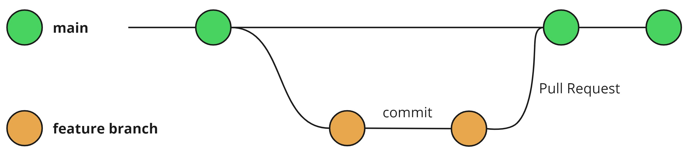

# Contribuição
## GitHub Flow
O GitHub Flow é um modelo de branching (ramificação) simples e eficaz para o desenvolvimento colaborativo de software no GitHub. Ele é projetado para facilitar a colaboração e a integração contínua, permitindo que equipes trabalhem em paralelo de forma organizada e colaborativa. Sua simplicidade, com menos ramificações, torna o GitHub Flow ideal para equipes menores, reduzindo as chances de conflitos de mesclagem e tornando o processo mais eficiente.



## Passos para a contribuição
1. **Clonar o repositório:**
   * Clone o repositório remoto para sua máquina local
   * Comando:
     ```bash
     git clone https://github.com/ifpebj-ti/Frontend-Planogram.git
     ```
2. **Criar uma Branch:**
   * Crie uma nova branch para cada funcionalidade ou correção.
   * Utilize a nomenclatura para as branches: feature/nome-da-funcionalidade ou bugfix/nome-da-correção
   * Comando:
     ```bash
     git checkout -b nome-da-branch
     ```
3. **Commits:**
   * Faça commits regulares com mensagens descritivas para manter um histórico claro das alterações.
   * Comando:
     ```bash
     git add .
     ```
     e

     ```bash
     git commit -m "Mensagem descritiva"
     ```
4. **Abrir um Pull Request (PR):**
   * Após terminar a funcionalidade ou correção, envie sua branch para o repositório remoto: 
     ```bash
     git push
     ```
   * Vá até o GitHub e abra um PR clicando em "Compare & pull request”, para revisão do código.
5. **Revisão de Código:**
   * A equipe revisará o código no PR. Comentários e sugestões podem ser feitos, e alterações podem ser solicitadas.
   * Enquanto o PR estiver aberto, é possível adicionar outros Commits para os ajustes sugeridos.
6. **Mesclar a Branch:**
   * Após a revisão e aprovação, mescle a branch de volta à branch principal usando a interface do GitHub para garantir um histórico limpo.
7. **Deletar a Branch:**
   * Após a mesclagem, exclua a branch para manter o repositório organizado.
